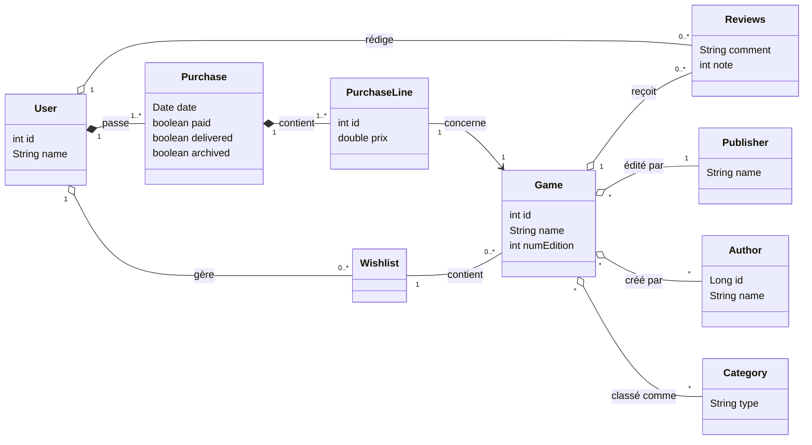

# Diagramme de classes Games Up

```mermaid
classDiagram
    direction LR

    class User {
        int id
        String name
    }

    class Purchase {
        Date date
        boolean paid
        boolean delivered
        boolean archived
    }

    class PurchaseLine {
        int id
        double prix
    }

    class Game {
        int id
        String name
        int numEdition
    }

    class Category {
        String type
    }

    class Publisher {
        String name
    }

    class Author {
        Long id
        String name
    }

    class Wishlist {
    }

    class Reviews {
        String comment
        int note
    }

    User "1" *-- "1..*" Purchase : passe
    Purchase "1" *-- "1..*" PurchaseLine : contient
    PurchaseLine "1" --> "1" Game : concerne
    User "1" o-- "0..*" Wishlist : gère
    Wishlist "1" -- "0..*" Game : contient
    User "1" o-- "0..*" Reviews : rédige
    Game "1" o-- "0..*" Reviews : reçoit
    Game "*" o-- "1" Publisher : édité par
    Game "*" o-- "*" Author : créé par
    Game "*" o-- "*" Category : classé comme
```

- `*--` indique une composition (l’objet composé n’existe pas sans son agrégat).
- `o--` représente une agrégation (lien fort mais sans cycle de vie partagé).
