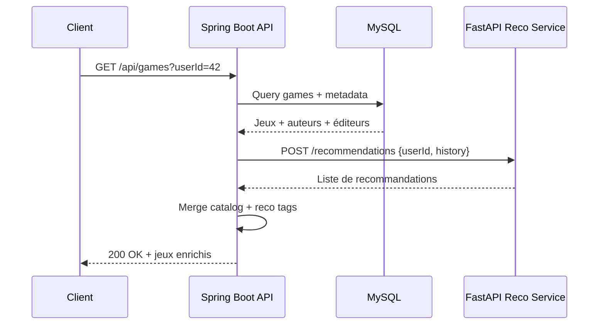
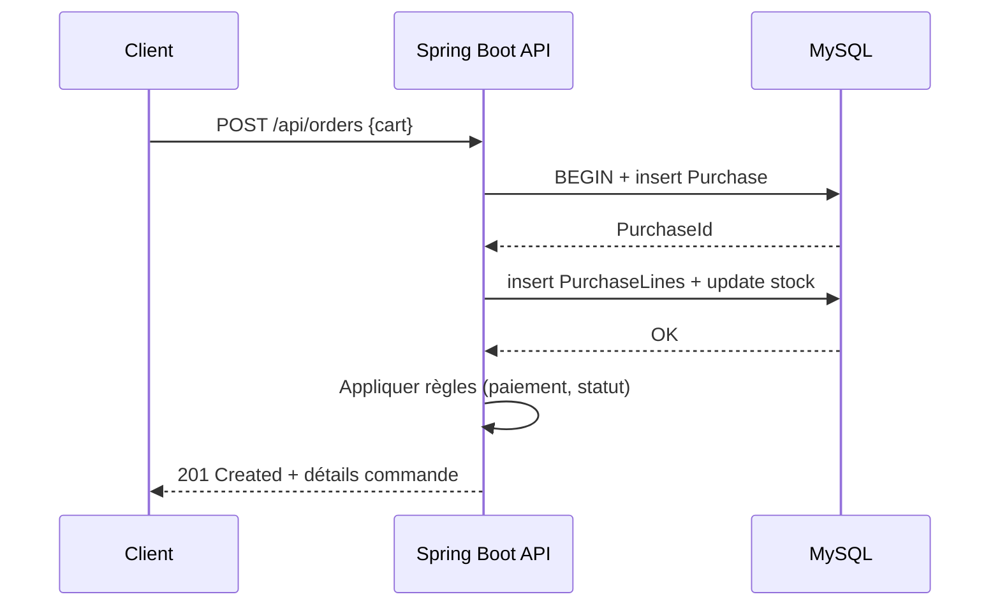
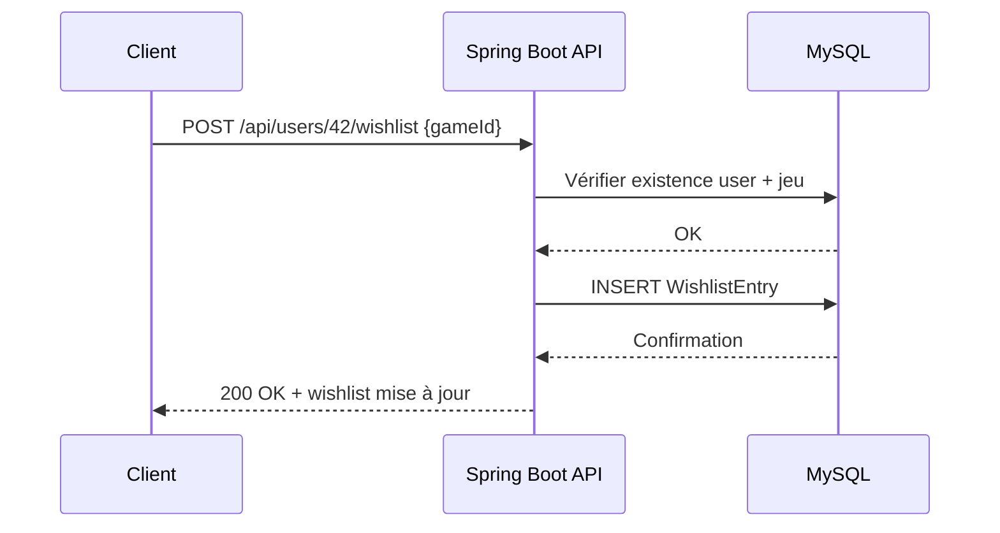
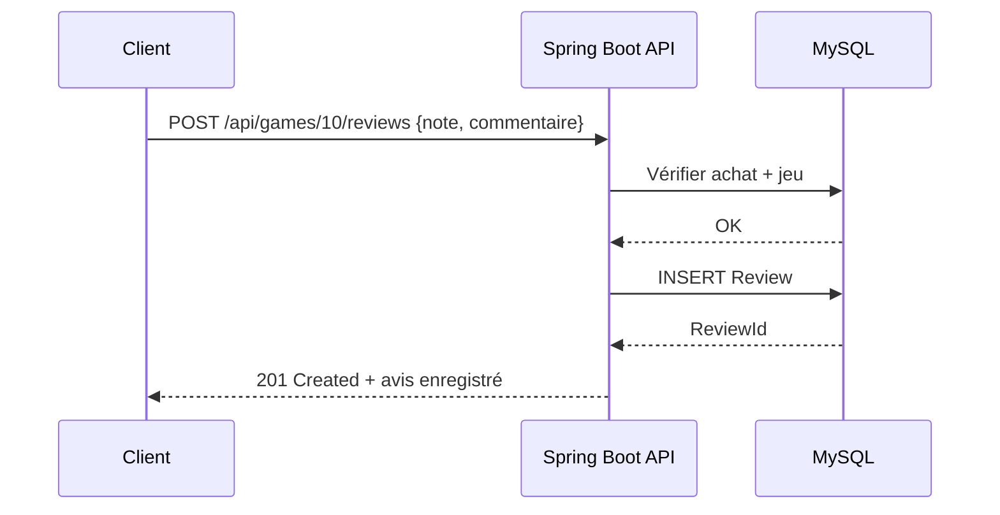

# Diagrammes de séquence Games Up

## Consultation du catalogue avec recommandations

```mermaid
sequenceDiagram
    participant Client
    participant API as Spring Boot API
    participant DB as MySQL
    participant IA as FastAPI Reco Service

    Client->>API: GET /api/games?userId=42
    API->>DB: Query games + metadata
    DB-->>API: Jeux + auteurs + éditeurs
    API->>IA: POST /recommendations {userId, history}
    IA-->>API: Liste de recommandations
    API->>API: Merge catalog + reco tags
    API-->>Client: 200 OK + jeux enrichis
```

## Passage d'une commande

```mermaid
sequenceDiagram
    participant Client
    participant API as Spring Boot API
    participant DB as MySQL

    Client->>API: POST /api/orders {cart}
    API->>DB: BEGIN + insert Purchase
    DB-->>API: PurchaseId
    API->>DB: insert PurchaseLines + update stock
    DB-->>API: OK
    API->>API: Appliquer règles (paiement, statut)
    API-->>Client: 201 Created + détails commande
```

## Ajout d'un jeu à la wishlist

```mermaid
sequenceDiagram
    participant Client
    participant API as Spring Boot API
    participant DB as MySQL

    Client->>API: POST /api/users/42/wishlist {gameId}
    API->>DB: Vérifier existence user + jeu
    DB-->>API: OK
    API->>DB: INSERT WishlistEntry
    DB-->>API: Confirmation
    API-->>Client: 200 OK + wishlist mise à jour
```

## Ajout d'un avis

```mermaid
sequenceDiagram
    participant Client
    participant API as Spring Boot API
    participant DB as MySQL

    Client->>API: POST /api/games/10/reviews {note, commentaire}
    API->>DB: Vérifier achat + jeu
    DB-->>API: OK
    API->>DB: INSERT Review
    DB-->>API: ReviewId
    API-->>Client: 201 Created + avis enregistré
```
